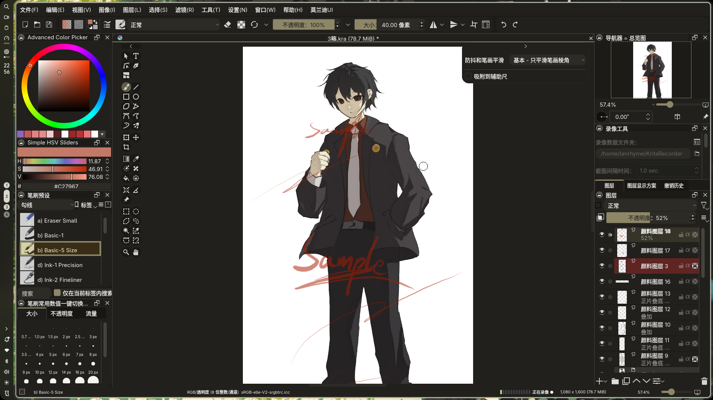

# Krita Morandi UI

A sleek, flat, and borderless UI redesign for Krita, heavily inspired by modern design paradigms. Now customized with the **Morandi theme** and fully translated into Chinese.

## 兼容性说明

本插件兼容 **Krita 5.0 及以上版本**（支持 PyQt5 与 PyQt6 双引擎环境）。

## 包含的内容

1. **Krita Morandi UI 插件**: `krita_morandi_ui` (包含 `__init__.py`, `redesign.py`, 等)
2. **Morandi 主题**: `Morandi.colors` (随附提供，请放入 Krita 的 `color-schemes` 目录中)

## 鸣谢与版权声明 (Credits & Copyright)

This plugin is a modified version based on the original **Krita UI Redesign** plugin. All original design and logic credits belong to their respective authors:

*   **Original Authors:** Kapyia, Pedro Reis (Copyright (C) 2020)

This program is free software under the GNU General Public License version 3.
